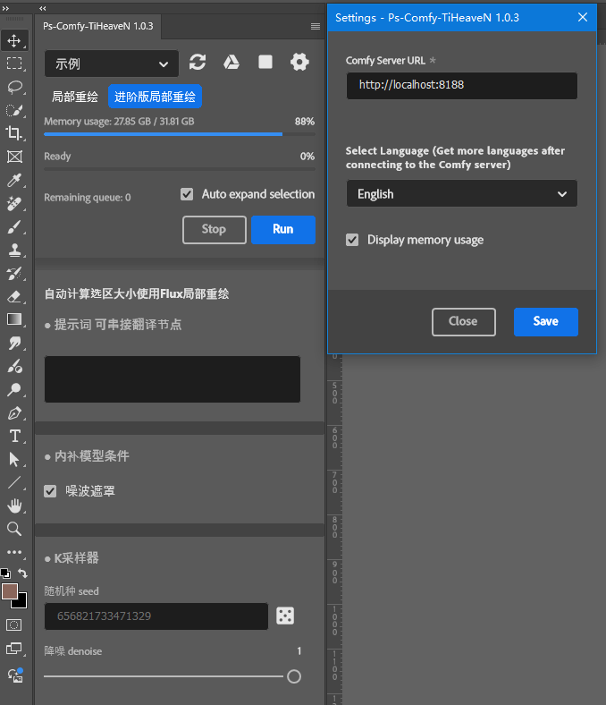
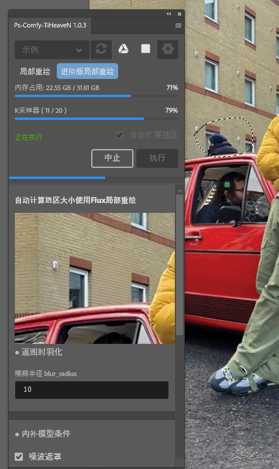
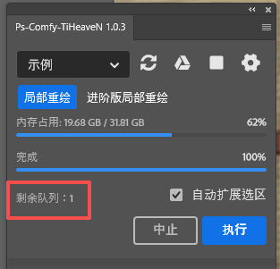
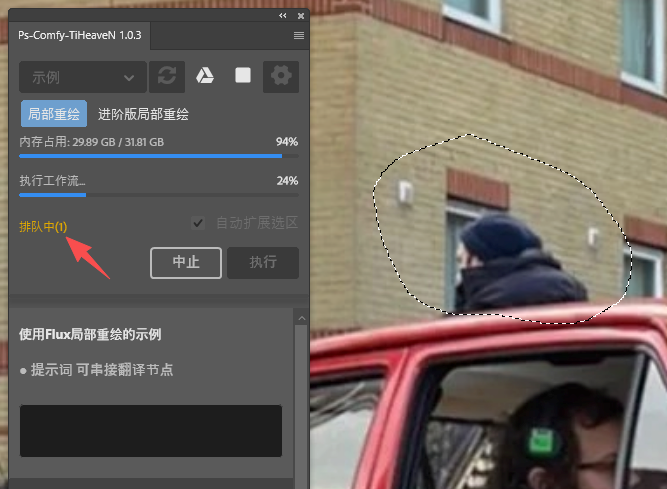
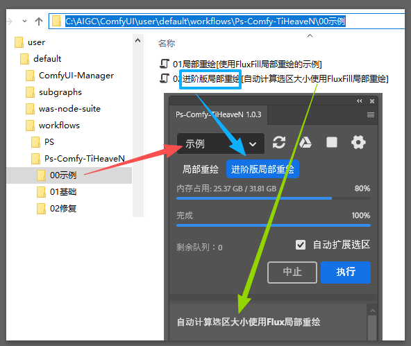
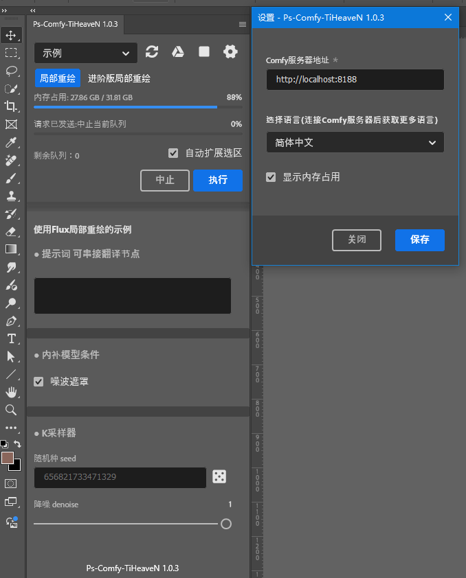
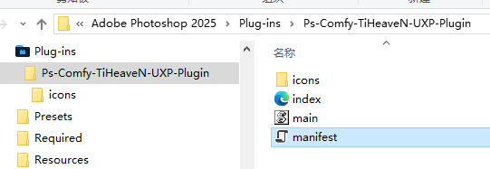
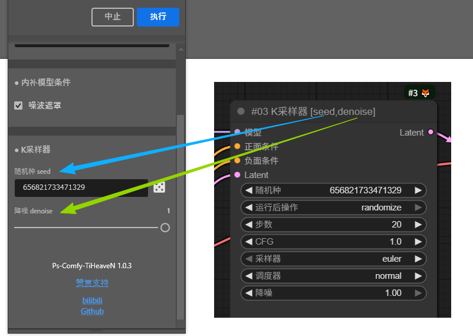

`往下翻有中文文档`

# Ps-Comfy-TiHeaveN-CustomNodes Documentation <br />

- [Video Demo](images/ps-comfy-tiheaven_demo.mp4)

# Project Introduction

Ps-Comfy-TiHeaveN-CustomNodes (ComfyUI Nodes) must be used in conjunction with Ps-Comfy-TiHeaveN-UXP-Plugin (Photoshop Plugin). Its core function is to perform local repainting in Photoshop. Through the linkage between the PS plugin and ComfyUI, it realizes automatic selection boundary expansion to enhance reference accuracy, while supporting sampler real-time preview, Smart Object return, and mask generation.



---

- **ComfyUI Nodes**: After installation, there are no visual nodes. It only adds new communication routes to the Comfy Server.

- **PS Plugin**: A mini-version of ComfyUI.

- **Core Workflow**: PS selects a region → passes parameters to ComfyUI → real-time preview → Smart Object pasted back in original position (with mask).

- **Principle**: The PS plugin accesses the relevant routes of the Comfy Server, obtains the modified workflow, and sends it back to the server for execution. The PS plugin will not modify or save the original workflow file in any way. There is no need to open a browser; detailed processes can be viewed in the ComfyUI console. Relevant examples are available under ComfyUI\script_examples.

- **Highlights**: No need to select a specific layer or create a mask in advance. The content corresponding to the selection is the currently visible image content. The image will be transmitted to the server in lossless PNG (RGBA) format without quality degradation. Finally, the rectangular image with expanded boundaries is loaded through the "Load Image Node", and the selection is passed to this node as a mask.<br />
Send the images and masks from Photoshop to Comfy; feel free to proceed with the rest of the workflow as you see fit.

- *Note: Temporary transmitted images are stored in this folder `ComfyUI\input\Ps-Comfy-TiHeaveN`. Please clean them up regularly.*

- **Other Small Functions**: Abort current queue, abort all queues, release model and cache occupancy, real-time queue status, and memory usage.

Real-time Queue Status: When you have both the PS plugin and browser open, and image generation is in progress in the browser, the PS plugin will display queue information, including the queuing status (when you execute a queue in PS).







# Dependency Environment

- **Photoshop**: ≥ 26.0.0

- **ComfyUI**: The latest version is recommended. Compatibility of older versions needs to be tested by users.

# Installation Tutorial

## 1. Install PS Plugin

1. Download the PS plugin Ps-Comfy-TiHeaveN-UXP-Plugin
  - [Github](https://github.com/tiheaven/Ps-Comfy-TiHeaveN-CustomNodes/releases/)

  - [Baidu Netdisk](https://pan.baidu.com/s/51RoomjsOFPTjjSyONh5i_A)

  - [Quark Netdisk](https://pan.quark.cn/s/5ffdb70ca4e3)

2. Extract the file to the Photoshop plugin directory (e.g.: Adobe Photoshop 2025\Plug-ins);

3. Ensure that the manifest.json file is directly visible in the extracted directory;

4. Launch Photoshop, open the "Plug-ins" menu, and you will see this plugin.

## 2. Install ComfyUI Nodes

1. Navigate to the ComfyUI custom nodes directory: ComfyUI\custom_nodes\;

2. Clone this repository:
        `git clone https://github.com/tiheaven/Ps-Comfy-TiHeaveN-CustomNodes.git`

3. Confirm the directory structure is ComfyUI\custom_nodes\Ps-Comfy-TiHeaveN-CustomNodes. If so, the installation is successful.

# Workflow Setup

## 1. Workflow Dedicated Folder Configuration

1. Create the main directory: ComfyUI\user\default\workflows\Ps-Comfy-TiHeaveN\;

2. Create subdirectories under the main directory, named using the rule: 01 Directory Name (sorted by number in the plugin, only "Directory Name" is displayed);

3. Place workflow JSON files in the subdirectories, named using the rule: 01 Workflow Name [Description] (numbers are for sorting, "Workflow Name" is displayed in the plugin).



## 2. Existing Workflow Modification Rules

- **Workflow Start and End Points**: Use "Load Image" as the start point and "Preview Image" as the end point (refer to the sample workflow for reference);

- **Node Exposure Rule**:
        Node naming format: #01 Node Name [Parameter1, Parameter2] (e.g.: #01 K Sampler [seed, denoise]). The plugin will only display the specified parameters (such as seed, denoise value);

- If no parameters are specified (only #01 Node Name), the plugin will display all parameters of the node;

- **Recommendation**: Debug the workflow in ComfyUI in advance and only expose key parameters to the plugin;

- [workflow example](workflows/)

**Conflict Note**: The aigodlike-comfyui-translation node may restore node names, causing the above rules to fail. Please pay attention to this.

# Multi-Language Support

- **Language Switching**: Languages can be switched in the plugin settings. Built-in languages: Simplified Chinese (default), Traditional Chinese, English;

- **Language Pack Path**: ComfyUI\custom_nodes\Ps-Comfy-TiHeaveN-CustomNodes\locales\;

- **Add New Language**: Copy en_US.json and rename it to <language code>.json (e.g.: de_DE.json), then translate the content using AI (the Traditional Chinese and English language packs of this plugin are both generated by Doubao Translation).

# Other Instructions

## Startup Verification

After starting ComfyUI, if the console outputs the following content, it indicates that Ps-Comfy-TiHeaveN-CustomNodes has been loaded successfully:

```plaintext

[Ps-Comfy-TiHeaveN]: If you see me, it means the loading has been successfully completed.
```

## New Routes

The plugin relies on the following routes to run. Ensure they are accessible:

- `http://127.0.0.1:8188/workflows/`:
        Used to obtain workflow files under `ComfyUI\user\default\workflows\Ps-Comfy-TiHeaveN\`;

- `http://127.0.0.1:8188/ps-comfy-tiheaven-locales/`:
        Used to obtain language packs.

If using it on the cloud, ensure the above two routes are accessible normally.

## About the Initial Version

Multi-queue functionality was designed in the initial version, but actual testing revealed bugs and it was meaningless for the entire workflow, so the multi-queue function was removed.

## Feedback Channel

### Known Issues

1. Subgraphs are not supported; please expand the Subgraphs in the workflow.

For questions or suggestions, please go to: [https://space.bilibili.com/399703773](https://space.bilibili.com/399703773) to provide feedback. This is my first time using Github, so I'm not familiar with many things.
> （注：以上文档内容全部由豆包翻译）


# Ps-Comfy-TiHeaveN-CustomNodes 说明文档 <br />
- [视频示例](images/ps-comfy-tiheaven_demo.mp4)

# 项目介绍

Ps-Comfy-TiHeaveN-CustomNodes（ComfyUI 节点）需配合 Ps-Comfy-TiHeaveN-UXP-Plugin（PS 插件）一起使用，主要功能为在Photoshop中进行局部重绘。通过 PS 插件与 ComfyUI 联动，实现选区自动扩展边界以提升参考度，同时支持采样器实时预览、智能对象返回及蒙版生成。<br>


---

<br>
---
- **ComfyUI 节点**：安装后并无可视化节点，仅为 Comfy服务器 新增通信路由；

- **PS 插件**：一个迷你版的ComfyUI

- **核心流程**：PS 勾选选区 → 传参至 ComfyUI → 实时预览 → 智能对象原位贴回（带蒙版）。

- **原理**：PS插件访问Comfy服务器的相关路由，获取改造的工作流，发回服务器运行，PS插件不会对原工作流文件进行任何修改及保存，不用打开浏览器，可在ComfyUI的控制台查看详细进程。ComfyUI\script_examples下有相关示例

- **亮点**：无需选中指定图层，也不用提前创建蒙版，选区对应的内容就是当前可见的图像内容。图像将以无损 PNG(RGBA) 格式传输至服务器，不会降低画质，最终将扩展边界后的矩形图像通过 “加载图像节点” 加载，再把选区作为遮罩传入了该节点。<br>
图像和遮罩从PS端发送到Comfy，剩下的流程您自己发挥即可。
- *注意: 传输的临时图像在此文件夹`ComfyUI\input\Ps-Comfy-TiHeaveN`，请定期清理。*

- **其它小功能**：中止当前队列、中止全部队列、释放模型及缓存占用、队列实时状态、内存占用情况。<br><br>
队列实时状态：当你同时打开了PS插件和浏览器，浏览器中正在进行生图，此时PS插件中会显示队列的信息，包括排队状态(当你在PS中执行了队列)。<br><br>
<br><br><br>

# 依赖环境

- **Photoshop**：>= 26.0.0

- **ComfyUI**：推荐最新版本，低版本需自行测试兼容性。

# 安装教程

## 1. 安装 PS 插件 

1. 下载 PS 插件 Ps-Comfy-TiHeaveN-UXP-Plugin
  - [Github](https://github.com/tiheaven/Ps-Comfy-TiHeaveN-CustomNodes/releases/)
  - [百度网盘](https://pan.baidu.com/s/51RoomjsOFPTjjSyONh5i_A)
  - [夸克网盘](https://pan.quark.cn/s/5ffdb70ca4e3)

2. 解压至 Photoshop 插件目录（例：Adobe Photoshop 2025\Plug-ins）；

3. 确认解压后目录内可直接看到 manifest.json 文件；<br>
<br>

4. 进入 Photoshop ，打开 增效工具 菜单 即可看到此插件。

## 2. 安装 ComfyUI 节点

1. 在 ComfyUI 自定义节点目录下：ComfyUI\custom_nodes\；

2. 克隆本仓库：
        `git clone https://github.com/tiheaven/Ps-Comfy-TiHeaveN-CustomNodes.git`

3. 确认目录结构为 ComfyUI\custom_nodes\Ps-Comfy-TiHeaveN-CustomNodes，即安装成功。

# 工作流设置

## 1. 工作流专属文件夹配置

1. 创建主目录：ComfyUI\user\default\workflows\Ps-Comfy-TiHeaveN\；

2. 在主目录下创建子目录，命名规则为 01 目录名（插件中按数字排序，仅显示 “目录名”）；

3. 在子目录中放置工作流 JSON 文件，命名规则为 01 工作流名称 [描述]（数字用于排序，插件中显示 “工作流名称”）。<br>
<br>

## 2. 现有工作流改造规则

- **流程起点与终点**：以 “加载图像” 为起点，“预览图像” 为终点（可参考示例工作流）；

- **节点暴露规则**：
        节点命名格式：#01 节点名 [参数1,参数2]（例：#01 K采样器 [seed,denoise]），插件仅显示指定参数（如随机种、降噪值）；<br>
        

- 若不指定参数（仅 #01 节点名），插件将显示整个节点的所有参数；

- 建议：提前在 ComfyUI 中调试好工作流，仅暴露关键参数至插件；

- [工作流示例](workflows/)

**冲突提示**：aigodlike-comfyui-translation 翻译节点可能还原节点命名，导致上述规则失效，需注意。

# 多语言支持

- **语言切换**：在插件设置中可切换语言，内置：简体中文（默认）、繁体中文、英文；

- **语言包路径**：ComfyUI\custom_nodes\Ps-Comfy-TiHeaveN-CustomNodes\locales\；

- **新增语言**：复制 en_US.json 并重命名为 <语言代号>.json（如 de_DE.json），通过 AI 翻译内容即可（本插件的繁体中文和英文语言包均由豆包翻译生成）。

# 其他说明

## 启动验证

启动 ComfyUI 后，若控制台输出以下内容，说明 Ps-Comfy-TiHeaveN-CustomNodes 加载成功：

```plaintext

[Ps-Comfy-TiHeaveN]: If you see me, it means the loading has been successfully completed.
```

## 新增路由

插件运行依赖以下路由，需确保可访问：

- `http://127.0.0.1:8188/workflows/`：
用于获取 `ComfyUI\user\default\workflows\Ps-Comfy-TiHeaveN\` 下的工作流文件；

- `http://127.0.0.1:8188/ps-comfy-tiheaven-locales/`：
用于获取语言包。

若在云端使用，需确保上述两个路由可正常访问。

## 关于初始版本

初始设计了可进行多队列，实测有BUG，且对于整个流程无意义，于是去除了多队列功能。

## 反馈渠道

### 已知问题

1. 不支持Subgraph(子图)，请大家解开工作流中的Subgraph(子图)

如有问题或建议，可前往：[https://space.bilibili.com/399703773](https://space.bilibili.com/399703773) 反馈，第一次用Github很多东西不熟。